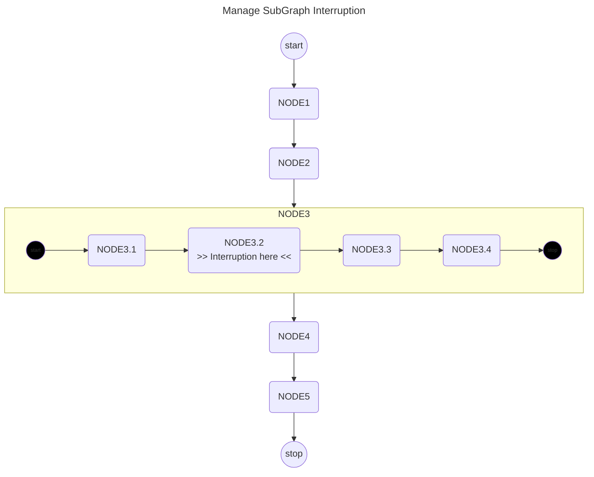

# LangGraph4j Manage Subgraph Interruption

```mermaid
---
title: Manage SubGraph Interruption
---
flowchart TD
	__START__((start))
	__END__((stop))
	NODE1("NODE1")
	NODE2("NODE2")
subgraph NODE3
	___START__((start)):::___START__
	___END__((stop)):::___END__
	_NODE3.1("NODE3.1")
	_NODE3.2("NODE3.2
	>> Interruption here <<")
	_NODE3.3("NODE3.3")
	_NODE3.4("NODE3.4")
	___START__:::___START__ --> _NODE3.1:::_NODE3.1
	_NODE3.1:::_NODE3.1 --> _NODE3.2:::_NODE3.2
	_NODE3.2:::_NODE3.2 --> _NODE3.3:::_NODE3.3
	_NODE3.3:::_NODE3.3 --> _NODE3.4:::_NODE3.4
	_NODE3.4:::_NODE3.4 --> ___END__:::___END__
end
	NODE4("NODE4")
	NODE5("NODE5")
	__START__:::__START__ --> NODE1:::NODE1
	NODE1:::NODE1 --> NODE2:::NODE2
	NODE2:::NODE2 --> NODE3:::NODE3
	NODE3:::NODE3 --> NODE4:::NODE4
	NODE4:::NODE4 --> NODE5:::NODE5
	NODE5:::NODE5 --> __END__:::__END__

	classDef ___START__ fill:black,stroke-width:1px,font-size:xx-small;
	classDef ___END__ fill:black,stroke-width:1px,font-size:xx-small;

```